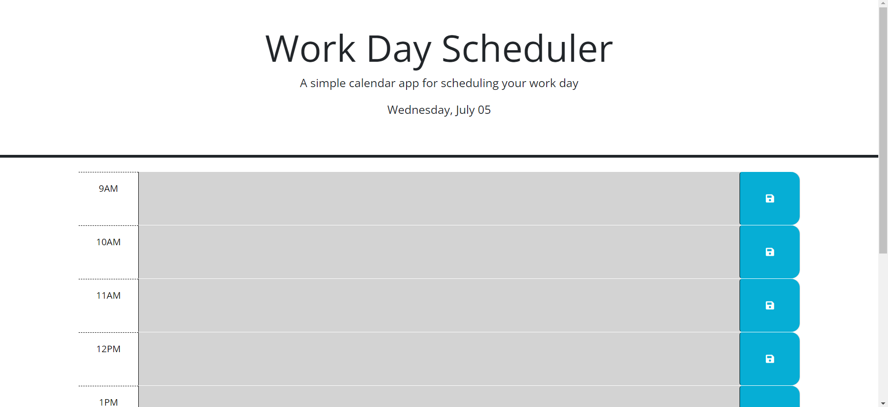

# Daily-Planner
This was created from the code given for the fifth challenge

## Reason for Planner
I want to create a planner to keep track of my daily agenda.

## Code Sources
The html file can be found under ```index.html```
The CSS style and reset style sheets can be found under ```/assets/styles/style.css``` and ```/assets/styles/reset.css```
The Javascript can be found under ```/assets/script/script.js```

## Link to Site

## Screenshot of site

